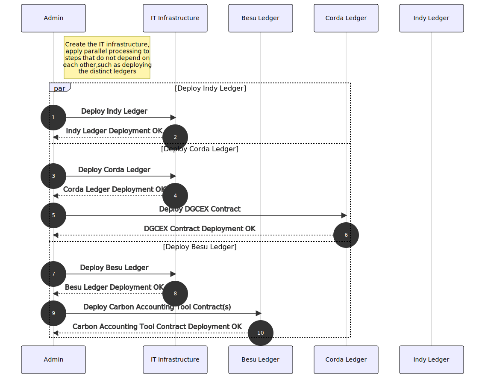

# Hyperledger Cactus Example Use for Trade Finance & BAFT<!-- omit in toc -->
# Table of Contents<!-- omit in toc -->

- [1. Initial notes/terminology (work in progress)](#1-initial-notesterminology-work-in-progress)
- [2. Data Model](#2-data-model)
  - [2.1 Class Diagram](#21-class-diagram)
- [3. Demo Infrastructure](#3-demo-infrastructure)
  - [3.1 Sequence Diagram of Provisioning Process](#31-sequence-diagram-of-provisioning-process)
- [4. Listing Lifecycle](#4-listing-lifecycle)
  - [4.1 Notes (work in progress)](#41-notes-work-in-progress)
  - [4.2 Sequence Diagram](#42-sequence-diagram)
- [Meeting Notes](#meeting-notes)

# 1. Initial notes/terminology (work in progress)

(PoP) Proof of Provenance - basic atomic construct that they build on top o

DLPC a particular type of PoP code
    - where is my inventory and how much?
    - token is just the how much, but not where.

Simplest use-case to start with:
Inventory/open account

attestation of transfer

MarcoPolo

RMI - responsible minerals initiative

BAFT - The Bankers Association for Finance and Trade

DLPC - intended to be simple, not much is prescribed
John: Perhaps an open account use case - it avoids some of the highly regulated aspects
(so it's more flexible)

Provenance

DLCC - distributed ledger carbon certifications
    Green aluminum -

The root of trust is the government agencies auditing the producers of the ingots
so we as technologists only concern ourselves with passing along the certificates
not verifying the root of the certificates themselves.

# 2. Data Model

## 2.1 Class Diagram

# 3. Demo Infrastructure

## 3.1 Sequence Diagram of Provisioning Process

# 4. Listing Lifecycle

## 4.1 Notes (work in progress)

Infra bootstrap flow:

Deploy ledgers, contracts (Decentralized Green Commodities EXchange)
Create DIDs for seller, buyer, government

Seller requests government certification
... off-chain: government inspection commences and passes
Govt. Agency Issues Indy "Verifiable Credential" to the DID of the seller
... off-chain: government publicizes their DID on the Indy ledger

Green Aluminum Purchase flow:

1. Seller lists aluminum ingot on DCGEX (Decentralized Green Commodities EXchange)
   1. Listing contains the DID of the seller (which has the VC for green certification issued by the government)
2. Buyer initiates purchase by
   1. Validating DID VC of seller (abort of verification fails)
   2. Creating the DLPC via DCGEX
3. DLPC goes through (reaches happy path end state)
4. DCGEX Issues Carbon Credits to Buyer once DLPC concludes
   1. This happens as a cross-ledger transaction where the Corda contract calls into the Besu (or XDai) ledger's carbon accounting tool to issue the tokens to the buyer

## 4.2 Sequence Diagram

# Meeting Notes

Andrea:
We need ESG scores: include transportation and everything else

Eugenio: we have 3 layers
- supply chain management layer (shipping) - bills of lading standards(?)
- invoicing layer (trade finance layer - the finance structure of the deal) - DLPC standard is relevant
- settlement layer
