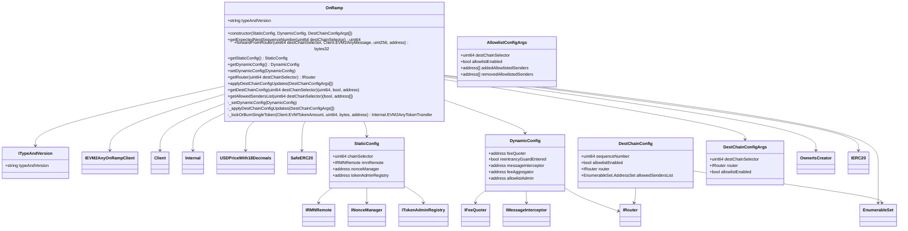

### OnRamp.sol Class Diagram

```mermaid
classDiagram
    %% Contracts
    class OnRamp {
        +string typeAndVersion
        +constructor(StaticConfig, DynamicConfig, DestChainConfigArgs[])
        +getExpectedNextSequenceNumber(uint64 destChainSelector) uint64
        +forwardFromRouter(uint64 destChainSelector, Client.EVM2AnyMessage, uint256, address) bytes32
        +getStaticConfig() StaticConfig
        +getDynamicConfig() DynamicConfig
        +setDynamicConfig(DynamicConfig)
        +getRouter(uint64 destChainSelector) IRouter
        +applyDestChainConfigUpdates(DestChainConfigArgs[])
        +getDestChainConfig(uint64 destChainSelector) (uint64, bool, address)
        +getAllowedSendersList(uint64 destChainSelector) (bool, address[])
        -_setDynamicConfig(DynamicConfig)
        -_applyDestChainConfigUpdates(DestChainConfigArgs[])
        -_lockOrBurnSingleToken(Client.EVMTokenAmount, uint64, bytes, address) Internal.EVM2AnyTokenTransfer
    }

    %% Interfaces
    class ITypeAndVersion {
        +string typeAndVersion
    }

    class IEVM2AnyOnRampClient {

    }
    class IFeeQuoter {

    }
    class IMessageInterceptor {

    }
    class INonceManager {

    }
    class IRMNRemote {

    }
    class IRouter {

    }
    class ITokenAdminRegistry {

    }
    
    %% Libraries
    class Client {

    }
    class Internal {

    }
 
    class USDPriceWith18Decimals {

    }
    class SafeERC20 {

    }
    class EnumerableSet {

    }

    %% Structs
    class StaticConfig {
        +uint64 chainSelector
        +IRMNRemote rmnRemote
        +address nonceManager
        +address tokenAdminRegistry
    }

    class DynamicConfig {
        +address feeQuoter
        +bool reentrancyGuardEntered
        +address messageInterceptor
        +address feeAggregator
        +address allowlistAdmin
    }

    class DestChainConfig {
        +uint64 sequenceNumber
        +bool allowlistEnabled
        +IRouter router
        +EnumerableSet.AddressSet allowedSendersList
    }

    class DestChainConfigArgs {
        +uint64 destChainSelector
        +IRouter router
        +bool allowlistEnabled
    }

    class AllowlistConfigArgs {
        +uint64 destChainSelector
        +bool allowlistEnabled
        +address[] addedAllowlistedSenders
        +address[] removedAllowlistedSenders
    }
    
    %% Relationships
    OnRamp --> ITypeAndVersion
    OnRamp --> IEVM2AnyOnRampClient
    OnRamp --> OwnerIsCreator
    OnRamp --> StaticConfig
    OnRamp --> DynamicConfig
    OnRamp --> DestChainConfigArgs
    OnRamp --> EnumerableSet
    OnRamp --> IERC20
    OnRamp --> SafeERC20
    OnRamp --> USDPriceWith18Decimals
    OnRamp --> Client
    OnRamp --> Internal
    StaticConfig --> IRMNRemote
    StaticConfig --> INonceManager
    StaticConfig --> ITokenAdminRegistry
    DynamicConfig --> IFeeQuoter
    DynamicConfig --> IMessageInterceptor
    DynamicConfig --> IRouter
    DestChainConfig --> EnumerableSet
    DestChainConfig --> IRouter
```