```mermaid
sequenceDiagram
autonumber

participant ChainB as Private Chain<br/><<fabric>>
participant Cacti as Cacti<br>CCIP Connector
participant EvmProxy as EvmProxy<br/><<evm>>
participant Chainlink as Chainlink<br/>DON & RMN
participant ChainA as Ethereum<br/>Mainnet<br/><<evm>>

rect rgb(90, 90, 90)
note left of ChainB: initialization
    Cacti->>EvmProxy: Deploy CCIP Contracts
    Cacti->>EvmProxy: Configure CCIP Contracts
    Chainlink->>EvmProxy: Fetch OffRamp Config
    Chainlink->>EvmProxy: FilterCCIPMessageSent()
    Cacti->>ChainB: subscribe(CCIPMessageSent)
end
rect rgb(90, 90, 90)
note left of ChainB: up & running
loop Until Exit
Cacti->>EvmProxy: Send Pending CCIP Messages
end
ChainB->>ChainB: router.ccipSend()
note right of ChainB: emit CCIPMessageSent()
ChainB-->>Cacti: Deliver Event CCIPMessageSent
Cacti->>EvmProxy: router.ccipSend()
EvmProxy->>EvmProxy: onRamp.forwardFromRouter()
note right of EvmProxy: emit CCIPMessageSent()
EvmProxy-->>Chainlink: Deliver Event CCIPMessageSent
Chainlink->>ChainA: offRamp.execute(message)
end

```

# Chainlink Docker Compose Setup

Links:
- https://www.npmjs.com/package/@chainlink/hardhat-chainlink
- https://www.npmjs.com/package/@chainsafe/web3-plugin-chainlink (maybe useful but not likely)

Run it from the Cacti project root:

```sh
yarn configure &&  \
yarn lerna run build:bundle --scope=@hyperledger/cactus-cmd-api-server && \
docker compose \
    --project-directory packages/cactus-test-tooling/src/main/resources/chainlink/ \
    --file packages/cactus-test-tooling/src/main/resources/chainlink/chainlink-aio.docker-compose.yaml \
    up \
    --build
```

If you prefer to observe the logs from a text file then redirect it like this:

```sh
docker compose \
	--project-directory packages/cactus-test-tooling/src/main/resources/chainlink/ \
	--file packages/cactus-test-tooling/src/main/resources/chainlink/chainlink-aio.docker-compose.yaml \
	up \
	--build &> /tmp/chainlink.log
```

## Events Used In Replication

**EVM2EVMOnRamp.sol**

```solidity
  // STATIC CONFIG
  string public constant override typeAndVersion = "EVM2EVMOnRamp 1.5.0";

/// RMN depends on this event, if changing, please notify the RMN maintainers.
event CCIPSendRequested(Internal.EVM2EVMMessage message);
```

**OnRamp.sol**

```solidity
  // STATIC CONFIG
  string public constant override typeAndVersion = "OnRamp 1.6.0-dev";

/// RMN depends on this event, if changing, please notify the RMN maintainers.
event CCIPMessageSent(
  uint64 indexed destChainSelector, uint64 indexed sequenceNumber, Internal.EVM2AnyRampMessage message
);
```

**OffRamp.sol**

```solidity
  // STATIC CONFIG
  string public constant override typeAndVersion = "OffRamp 1.6.0-dev";

  /// @dev RMN depends on this event, if changing, please notify the RMN maintainers.
  event CommitReportAccepted(Internal.MerkleRoot[] merkleRoots, Internal.PriceUpdates priceUpdates);
  event RootRemoved(bytes32 root);
```

```solidity
 emit ReportAccepted(report);
```

```solidity
/// @notice Report that is committed by the observing DON at the committing phase
/// @dev RMN depends on this struct, if changing, please notify the RMN maintainers.
struct CommitReport {
  Internal.PriceUpdates priceUpdates;
  Interval interval;
  bytes32 merkleRoot;
}
```

```solidity
  /// @notice Enum listing the possible message execution states within
  /// the offRamp contract.
  /// UNTOUCHED never executed
  /// IN_PROGRESS currently being executed, used a replay protection
  /// SUCCESS successfully executed. End state
  /// FAILURE unsuccessfully executed, manual execution is now enabled.
  /// @dev RMN depends on this enum, if changing, please notify the RMN maintainers.
  enum MessageExecutionState {
    UNTOUCHED,
    IN_PROGRESS,
    SUCCESS,
    FAILURE
  }
```

## Importing a P2P Key

```sh
peter@zend:~$ docker exec chainlink1 sh -c 'chainlink admin login --file /chainlink/.api'
Successfully Logged In.
peter@zend:~$ docker exec chainlink1 sh -c 'chainlink keys p2p import /chainlink/secrets/bootstrapper-p2p-key-data.json --old-password=/chainlink/secrets/bootstrapper-p2p-password.txt'
🔑 Imported P2P key
🔑 P2P Keys

----------------------------------------------------------------------------
ID:         12D3KooWSPPcj5FKg9fmQ3jBRB27bdLD1QbLBKwLCZDmpgnzNRzf
Peer ID:    p2p_12D3KooWSPPcj5FKg9fmQ3jBRB27bdLD1QbLBKwLCZDmpgnzNRzf
Public key: f630cb73d86d75f4f4db9fd174204512530fd33941e81c636a8e6a0db7c0f0a8
----------------------------------------------------------------------------


```

Debug a Reverted Transaction:

```sh
curl -X POST --data '{"jsonrpc": "2.0", "method": "trace_transaction","params": ["0xfaff10cd38a321273863faf009d3d2c7eeb7d7dc502f47a6858bbc5b2d21113b"],"id": 1}' http://127.0.0.1:8545

{
  "jsonrpc": "2.0",
  "id": 1,
  "result": [
    {
      "action": {
        "callType": "call",
        "from": "0x627306090abab3a6e1400e9345bc60c78a8bef57",
        "gas": "0xe4829c",
        "input": "0x96f4e9f90000000000000000000000000000000000000000000000000000666162726963000000000000000000000000000000000000000000000000000000000000004000000000000000000000000000000000000000000000000000000000000000a000000000000000000000000000000000000000000000000000000000000000e000000000000000000000000000000000000000000000000000000000000001200000000000000000000000002a504b5e7ec284aca5b6f49716611237239f0b9700000000000000000000000000000000000000000000000000000000000001800000000000000000000000000000000000000000000000000000000000000020000000000000000000000000d95b1dbec167c6cf547d018ddecf41a4cb2e2f73000000000000000000000000000000000000000000000000000000000000000b48656c6c6f20434349502100000000000000000000000000000000000000000000000000000000000000000000000000000000000000000000000000000000010000000000000000000000002a504b5e7ec284aca5b6f49716611237239f0b97000000000000000000000000000000000000000000000000000000000000001400000000000000000000000000000000000000000000000000000000000000400000000000000000000000000000000000000000000000000000000005f5e0ff0000000000000000000000000000000000000000000000000000000000000000",
        "to": "0x8acee021a27779d8e98b9650722676b850b25e11",
        "value": "0x0"
      },
      "blockHash": "0xdee13d33640a41896501e3ef5413ad7d12b2546820d388e0eb390913b2cbd1e6",
      "blockNumber": 278,
      "error": "Reverted",
      "revertReason": "0x5247fdce",
      "subtraces": 2,
      "traceAddress": [],
      "transactionHash": "0xfaff10cd38a321273863faf009d3d2c7eeb7d7dc502f47a6858bbc5b2d21113b",
      "transactionPosition": 0,
      "type": "call"
    },
    {
      "action": {
        "callType": "staticcall",
        "from": "0x8acee021a27779d8e98b9650722676b850b25e11",
        "gas": "0xe0dc7e",
        "input": "0x397796f7",
        "to": "0xb529f14aa8096f943177c09ca294ad66d2e08b1f",
        "value": "0x0"
      },
      "blockHash": "0xdee13d33640a41896501e3ef5413ad7d12b2546820d388e0eb390913b2cbd1e6",
      "blockNumber": 278,
      "result": {
        "gasUsed": "0x25b7",
        "output": "0x0000000000000000000000000000000000000000000000000000000000000000"
      },
      "subtraces": 1,
      "traceAddress": [0],
      "transactionHash": "0xfaff10cd38a321273863faf009d3d2c7eeb7d7dc502f47a6858bbc5b2d21113b",
      "transactionPosition": 0,
      "type": "call"
    },
    {
      "action": {
        "callType": "call",
        "from": "0xb529f14aa8096f943177c09ca294ad66d2e08b1f",
        "gas": "0xdd45bb",
        "input": "0x397796f7",
        "to": "0xa4392264a2d8c998901d10c154c91725b1bf0158",
        "value": "0x0"
      },
      "blockHash": "0xdee13d33640a41896501e3ef5413ad7d12b2546820d388e0eb390913b2cbd1e6",
      "blockNumber": 278,
      "result": {
        "gasUsed": "0x11f1",
        "output": "0x0000000000000000000000000000000000000000000000000000000000000000"
      },
      "subtraces": 0,
      "traceAddress": [0, 0],
      "transactionHash": "0xfaff10cd38a321273863faf009d3d2c7eeb7d7dc502f47a6858bbc5b2d21113b",
      "transactionPosition": 0,
      "type": "call"
    },
    {
      "action": {
        "callType": "staticcall",
        "from": "0x8acee021a27779d8e98b9650722676b850b25e11",
        "gas": "0xe09e37",
        "input": "0x20487ded0000000000000000000000000000000000000000000000000000666162726963000000000000000000000000000000000000000000000000000000000000004000000000000000000000000000000000000000000000000000000000000000a000000000000000000000000000000000000000000000000000000000000000e000000000000000000000000000000000000000000000000000000000000001200000000000000000000000002a504b5e7ec284aca5b6f49716611237239f0b9700000000000000000000000000000000000000000000000000000000000001800000000000000000000000000000000000000000000000000000000000000020000000000000000000000000d95b1dbec167c6cf547d018ddecf41a4cb2e2f73000000000000000000000000000000000000000000000000000000000000000b48656c6c6f20434349502100000000000000000000000000000000000000000000000000000000000000000000000000000000000000000000000000000000010000000000000000000000002a504b5e7ec284aca5b6f49716611237239f0b97000000000000000000000000000000000000000000000000000000000000001400000000000000000000000000000000000000000000000000000000000000400000000000000000000000000000000000000000000000000000000005f5e0ff0000000000000000000000000000000000000000000000000000000000000000",
        "to": "0x1411cb266fced1587b0aa29e9d5a9ef3db64a9c5",
        "value": "0x0"
      },
      "blockHash": "0xdee13d33640a41896501e3ef5413ad7d12b2546820d388e0eb390913b2cbd1e6",
      "blockNumber": 278,
      "error": "Reverted",
      "subtraces": 0,
      "traceAddress": [1],
      "transactionHash": "0xfaff10cd38a321273863faf009d3d2c7eeb7d7dc502f47a6858bbc5b2d21113b",
      "transactionPosition": 0,
      "type": "call"
    }
  ]
}
```

```sh
./packages/cactus-test-tooling/src/main/resources/infra-bootstrap.sh
```

## Chainlink Node Integration Tests

- `core/services/ocr2/plugins/ccip/testhelpers/integration/chainlink.go`
- `core/services/ocr2/plugins/ccip/testhelpers/ccip_contracts.go`
- `core/services/ocr2/plugins/ccip/testhelpers/integration/jobspec.go`

### Extracted Job Spec Configurations for `TestIntegration_CCIP`:

**bootstrap-SimulatedSource**

```toml
name = 'bootstrap-besu'
type = 'bootstrap'
schemaVersion = 1
maxTaskDuration = '30s'
forwardingAllowed = false

contractID = '0x9e823597351791060F75EcC7F61Eea18DDa497Fd'
relay = 'evm'
chainID = '90000001'
p2pv2Bootstrappers = []
ocrKeyBundleID = ''
monitoringEndpoint = ''
transmitterID = ''
blockchainTimeout = '0s'
contractConfigTrackerPollInterval = '20s'
contractConfigConfirmations = 1
pluginType = ''
captureEATelemetry = false
captureAutomationCustomTelemetry = false

[relayConfig]
chainID = 90000001
```

http://localhost:6688/query

```json
{
  "operationName": "CreateJob",
  "variables": {
    "input": {
      "TOML": "name = 'bootstrap-besu'\ntype = 'bootstrap'\nschemaVersion = 1\nmaxTaskDuration = '30s'\nforwardingAllowed = false\n\ncontractID = '0x63a0F110d6C4712000345E05adDCA534520eb865'\nrelay = 'evm'\nchainID = '90000001'\np2pv2Bootstrappers = []\nocrKeyBundleID = ''\nmonitoringEndpoint = ''\ntransmitterID = ''\nblockchainTimeout = '0s'\ncontractConfigTrackerPollInterval = '20s'\ncontractConfigConfirmations = 1\npluginType = ''\ncaptureEATelemetry = false\ncaptureAutomationCustomTelemetry = false\n\n[relayConfig]\nchainID = 90000001"
    }
  },
  "query": "mutation CreateJob($input: CreateJobInput!) {\n  createJob(input: $input) {\n    ... on CreateJobSuccess {\n      job {\n        id\n        __typename\n      }\n      __typename\n    }\n    ... on InputErrors {\n      errors {\n        path\n        message\n        code\n        __typename\n      }\n      __typename\n    }\n    __typename\n  }\n}\n"
}
```

```sh
curl 'http://localhost:6688/query' -X POST -H 'Accept: */*' -H 'Accept-Encoding: gzip, deflate, br, zstd' -H 'Referer: http://localhost:6688/jobs/new' -H 'content-type: application/json' -H 'Origin: http://localhost:6688' -H 'DNT: 1' -H 'Connection: keep-alive' -H 'Cookie: connect.sid=s%3AYIC9ort25pppJCxqn6vA21yLLyuWqeei.dBmZKKwaNGNUj09oGnsGJlElJObpbzWd6cpNJ6em4GY; local_adminer_session=322316; adminer_sid=647dce8e13810b35710a77ef1bbaf897; session=.eJzVT0FqxDAQ-4qZcyi2J7bHeUXvZVnG4_EmkHZLnD0t-_e6_UUvEkISSE-4tp37qh2WjyeYcxB8au98U5jgfVfuavb7zWxf5rwbFhmmOdetm--ReYPLa_onvcs0zh7aV1jO46FDbRUWSM5lLz40bOUXM3KzGNTaOZEvnqIiR7ahxlgJfSolNPUeM7smc5VSA7nSMtXaUFKayUeJM4kkQR8ZFUOWTFyClEQlzDmWxqNiU0w05l8fXY-_Ne71A65mfdI.ZrEkkA.rBhq7SCyNZLZEpw4iCpFROMX7Zk; PGADMIN_LANGUAGE=en; clsession=MTczNjM2NjE2NnxEWDhFQVFMX2dBQUJFQUVRQUFCR180QUFBUVp6ZEhKcGJtY01EZ0FNWTJ4elpYTnphVzl1WDJsa0JuTjBjbWx1Wnd3aUFDQTFNRFkzWmpNMU1qazNOalUwTlRZek9HVTVZVFF4WTJKaU1qZzRaREpsT1E9PXw5Jn99lqk2_848HAcrbwx8X-FkD6U6tlYu20S4EeLGoQ==' -H 'Sec-Fetch-Dest: empty' -H 'Sec-Fetch-Mode: cors' -H 'Sec-Fetch-Site: same-origin' -H 'Priority: u=4' --data-raw $'{"operationName":"CreateJob","variables":{"input":{"TOML":"name = \'bootstrap-besu\'\\ntype = \'bootstrap\'\\nschemaVersion = 1\\nmaxTaskDuration = \'30s\'\\nforwardingAllowed = false\\n\\ncontractID = \'0x63a0F110d6C4712000345E05adDCA534520eb865\'\\nrelay = \'evm\'\\nchainID = \'90000001\'\\np2pv2Bootstrappers = []\\nocrKeyBundleID = \'\'\\nmonitoringEndpoint = \'\'\\ntransmitterID = \'\'\\nblockchainTimeout = \'0s\'\\ncontractConfigTrackerPollInterval = \'20s\'\\ncontractConfigConfirmations = 1\\npluginType = \'\'\\ncaptureEATelemetry = false\\ncaptureAutomationCustomTelemetry = false\\n\\n[relayConfig]\\nchainID = 90000001"}},"query":"mutation CreateJob($input: CreateJobInput\041) {\\n  createJob(input: $input) {\\n    ... on CreateJobSuccess {\\n      job {\\n        id\\n        __typename\\n      }\\n      __typename\\n    }\\n    ... on InputErrors {\\n      errors {\\n        path\\n        message\\n        code\\n        __typename\\n      }\\n      __typename\\n    }\\n    __typename\\n  }\\n}\\n"}'
```

`Job successfully created but could not start service: failed to create services for job: 2: error calling 'relayer.NewConfigWatcher': log poller disabled`

**ccip-commit-SimulatedSource-SimulatedDest**

```toml
name = 'ccip-commit-SimulatedSource-SimulatedDest'
type = 'offchainreporting2'
schemaVersion = 1
relay = "evm"
maxTaskDuration = '1h'
forwardingAllowed = false
contractID = 'the comit store helper contract address'
pluginType = 'ccip-commit'
transmitterID = 'the EVM key ID of the node'
p2pv2Bootstrappers = ['12D3KooWSPPcj5FKg9fmQ3jBRB27bdLD1QbLBKwLCZDmpgnzNRzf@chainlink1:6690']

[relayConfig]

chainID = 90000001

[pluginConfig]
destStartBlock = 86
offRamp = '"the off ramp contract address"'
tokenPricesUSDPipeline = """
// Price 1
link [type=http method=GET url="http://127.0.0.1:34335"];
link_parse [type=jsonparse path="UsdPerLink"];
link->link_parse;
eth [type=http method=GET url="http://127.0.0.1:33895"];
eth_parse [type=jsonparse path="UsdPerETH"];
eth->eth_parse;
"""
```

**ccip-exec-SimulatedSource-SimulatedDest**

```toml
name = 'ccip-exec-SimulatedSource-SimulatedDest'
type = 'offchainreporting2'
maxTaskDuration = ''
forwardingAllowed = false
observationSource = ''

[OCR2OracleSpec]
contractID = '0xB56D9238dDc576ee967d40393672f41519F494bd'
relay = 'evm'
chainID = ''
p2pv2Bootstrappers = []
ocrKeyBundleID = ''
monitoringEndpoint = ''
transmitterID = ''
blockchainTimeout = '0s'
contractConfigTrackerPollInterval = '20s'
contractConfigConfirmations = 1
pluginType = 'ccip-execution'
captureEATelemetry = false
captureAutomationCustomTelemetry = false

[OCR2OracleSpec.relayConfig]
chainID = 90000001

[OCR2OracleSpec.pluginConfig]
destStartBlock = 86
```

**ccip-commit-SimulatedSource-SimulatedDest-v2**

```toml
name = 'ccip-commit-SimulatedSource-SimulatedDest-v2'
type = 'offchainreporting2'
maxTaskDuration = ''
forwardingAllowed = false
observationSource = ''

[OCR2OracleSpec]
contractID = '0x85B793a5a6a75E110b64625A5CA7ACbBefA738a7'
relay = 'evm'
chainID = ''
p2pv2Bootstrappers = []
ocrKeyBundleID = ''
monitoringEndpoint = ''
transmitterID = ''
blockchainTimeout = '0s'
contractConfigTrackerPollInterval = '20s'
contractConfigConfirmations = 1
pluginType = 'ccip-commit'
captureEATelemetry = false
captureAutomationCustomTelemetry = false

[OCR2OracleSpec.relayConfig]
chainID = 90000001

[OCR2OracleSpec.pluginConfig]
destStartBlock = 229
offRamp = '"0x911600531983d1D0b87B34a758B18c41d08eA976"'
sourceStartBlock = 249
tokenPricesUSDPipeline = """"

// Price 1
link [type=http method=GET url="http://127.0.0.1:34335"];
link_parse [type=jsonparse path="UsdPerLink"];
link->link_parse;
eth [type=http method=GET url="http://127.0.0.1:33895"];
eth_parse [type=jsonparse path="UsdPerETH"];
eth->eth_parse;
merge [type=merge left="{}" right="{"0x44b769527cc4FE3124e2af50e1918038e07c6482":$(link_parse), "0xFC38956ec1da09d9C88e95cFC1E70216159B91fb":$(eth_parse), "0xFEa694b841326dE61d8E502B1E2E94d07F128F12":$(eth_parse)}"];
""""
```

**ccip-exec-SimulatedSource-SimulatedDest-v2**

```toml
name = 'ccip-exec-SimulatedSource-SimulatedDest-v2'
type = 'offchainreporting2'
maxTaskDuration = ''
forwardingAllowed = false
observationSource = ''

[OCR2OracleSpec]
contractID = '0x911600531983d1D0b87B34a758B18c41d08eA976'
relay = 'evm'
chainID = ''
p2pv2Bootstrappers = []
ocrKeyBundleID = ''
monitoringEndpoint = ''
transmitterID = ''
blockchainTimeout = '0s'
contractConfigTrackerPollInterval = '20s'
contractConfigConfirmations = 1
pluginType = 'ccip-execution'
captureEATelemetry = false
captureAutomationCustomTelemetry = false

[OCR2OracleSpec.relayConfig]
chainID = 90000001

[OCR2OracleSpec.pluginConfig]
destStartBlock = 229
sourceStartBlock = 249
```

**bootstrap-SimulatedDest**

```toml
name = 'bootstrap-SimulatedDest'
type = 'bootstrap'
maxTaskDuration = ''
forwardingAllowed = false
observationSource = ''

[OCR2OracleSpec]
contractID = '0xffdefe493D73398CC29a7e72216D81ee58754635'
relay = 'evm'
chainID = ''
p2pv2Bootstrappers = []
ocrKeyBundleID = ''
monitoringEndpoint = ''
transmitterID = ''
blockchainTimeout = '0s'
contractConfigTrackerPollInterval = '20s'
contractConfigConfirmations = 1
pluginType = ''
captureEATelemetry = false
captureAutomationCustomTelemetry = false

[OCR2OracleSpec.relayConfig]
chainID = 90000001
```

**ccip-commit-SimulatedSource-SimulatedDest**

```toml
name = 'ccip-commit-SimulatedSource-SimulatedDest'
type = 'offchainreporting2'
maxTaskDuration = ''
forwardingAllowed = false
observationSource = ''

[OCR2OracleSpec]
contractID = '0xffdefe493D73398CC29a7e72216D81ee58754635'
relay = 'evm'
chainID = ''
p2pv2Bootstrappers = []
ocrKeyBundleID = ''
monitoringEndpoint = ''
transmitterID = ''
blockchainTimeout = '0s'
contractConfigTrackerPollInterval = '20s'
contractConfigConfirmations = 1
pluginType = 'ccip-commit'
captureEATelemetry = false
captureAutomationCustomTelemetry = false

[OCR2OracleSpec.relayConfig]
chainID = 90000001

[OCR2OracleSpec.pluginConfig]
destStartBlock = 88
offRamp = '"0xbACc9843a1A102ef39262Ca44A7331a35F4958C5"'
priceGetterConfig = """"
{
 "aggregatorPrices": {
  "0x49a37926de8b7672b5e6e587e786892156be7c27": {
   "chainID": "90000001",
   "contractAddress": "0xd31538583eb075a3df5a833c59e9c44a86af6406"
  },
  "0x836c9f6c549d638cdfb963c7f4e578d57101d76a": {
   "chainID": "1000",
   "contractAddress": "0x5e56ccdedeac200abc6475025a4755d7c443c6a0"
  },
  "0x8c2162be397b8e6fc02505693c9fdc00a97a1119": {
   "chainID": "90000001",
   "contractAddress": "0xd31538583eb075a3df5a833c59e9c44a86af6406"
  }
 },
 "staticPrices": {}
}
""""
```

```go
// CommitJobSpec generates template for CCIP-relay job spec.
// OCRKeyBundleID,TransmitterID need to be set from the calling function
func (params CCIPJobSpecParams) CommitJobSpec() (*OCR2TaskJobSpec, error) {
	err := params.ValidateCommitJobSpec()
	if err != nil {
		return nil, fmt.Errorf("invalid job spec params: %w", err)
	}

	pluginConfig := map[string]interface{}{
		"offRamp": fmt.Sprintf(`"%s"`, params.OffRamp.Hex()),
	}
	if params.TokenPricesUSDPipeline != "" {
		pluginConfig["tokenPricesUSDPipeline"] = fmt.Sprintf(`"""
%s
"""`, params.TokenPricesUSDPipeline)
	}
	if params.PriceGetterConfig != "" {
		pluginConfig["priceGetterConfig"] = fmt.Sprintf(`"""
%s
"""`, params.PriceGetterConfig)
	}

	ocrSpec := job.OCR2OracleSpec{
		Relay:                             relay.NetworkEVM,
		PluginType:                        types.CCIPCommit,
		ContractID:                        params.CommitStore.Hex(),
		ContractConfigConfirmations:       1,
		ContractConfigTrackerPollInterval: models.Interval(20 * time.Second),
		P2PV2Bootstrappers:                params.P2PV2Bootstrappers,
		PluginConfig:                      pluginConfig,
		RelayConfig: map[string]interface{}{
			"chainID": params.DestEvmChainId,
		},
	}
	if params.DestStartBlock > 0 {
		ocrSpec.PluginConfig["destStartBlock"] = params.DestStartBlock
	}
	if params.SourceStartBlock > 0 {
		ocrSpec.PluginConfig["sourceStartBlock"] = params.SourceStartBlock
	}
	jobSpec := &OCR2TaskJobSpec{
		OCR2OracleSpec: ocrSpec,
		JobType:        "offchainreporting2",
		Name:           JobName(Commit, params.SourceChainName, params.DestChainName, params.Version),
	}

	b, err := toml.Marshal(jobSpec)
	if err != nil {
		panic(err)
	}
	fmt.Println(string(b))

	return jobSpec, nil
}
```

## Contracts in Production

### Ethereum Mainnet

https://docs.chain.link/ccip/directory/mainnet/chain/mainnet

https://etherscan.io/address/0x925228D7B82d883Dde340A55Fe8e6dA56244A22C

https://etherscan.io/address/0x411dE17f12D1A34ecC7F45f49844626267c75e81#code

https://etherscan.io/address/0x8B63b3DE93431C0f756A493644d128134291fA1b#code

https://vscode.blockscan.com/ethereum/0x8B63b3DE93431C0f756A493644d128134291fA1b

## VSCode Search Exclude Pattern for Chainlink Node Repository

```
*.t.sol,*test.go,.github/,./contracts/test/,./integration-tests/,./core/web/,CHANGELOG.md,go.mod,go.sum,./integration_tests
```

## Embedded EVM Demonstrator Code

This doesn't yet have the client integrated with it, so you can't connect to it
through a JSON-RPC endpoint just yet (web3, ethers).

1. Extend it with the client so that it can listen on 8545 and 8546 ports (HTTP and websocket)
2. Demonstate with web3 that it is possible to connect to it and run transactions

```javascript
import { VM } from "@ethereumjs/vm";
import { Common, Hardfork, Chain } from "@ethereumjs/common";
import { Blockchain } from "@ethereumjs/blockchain";
import { Account, Address } from "@ethereumjs/util";
import { LegacyTransaction, TransactionFactory } from "@ethereumjs/tx";
import { ethers } from "ethers";
import jsonStringify from "fast-safe-stringify";
("fast-safe-stringify");

async function main() {
  const common = new Common({
    chain: Chain.Mainnet,
    hardfork: Hardfork.Shanghai,
  });

  // Use the safe static constructor which awaits the init method
  const blockchain = await Blockchain.create({
    validateBlocks: false, // Skipping validation so we can make a simple chain without having to provide complete blocks
    validateConsensus: false,
    common,
  });

  const vm = await VM.create({ common, blockchain });
  vm.DEBUG = true;

  // Create an account with some funds
  const privateKey = Buffer.from(
    "1d3d1b257f559ffaf6db2bb88e60e2d9ee1d7e3940e326d34c88bfce7067bd20",
    "hex",
  );
  const senderAddress = Address.fromPrivateKey(privateKey);
  const senderAccount = new Account();
  senderAccount.balance = 10n * 10n ** 18n; // 10 ETH in wei

  await vm.stateManager.putAccount(senderAddress, senderAccount);

  // Solidity source code
  const contractSource = `
    pragma solidity ^0.8.0;

    contract MyContract {
        event MyTestEvent();

        function myTestMethod() public {
            emit MyTestEvent();
        }
    }
  `;

  // Compile Solidity contract
  const { abi, bytecode } = await compileSolidity(contractSource);

  // Deploy contract
  const deployTxData = "0x" + bytecode;
  const deployTx = LegacyTransaction.fromTxData(
    {
      nonce: 0,
      gasLimit: 3000000,
      gasPrice: 1000000000,
      data: deployTxData,
    },
    { common },
  ).sign(privateKey);

  const deployResult = await vm.runTx({ tx: deployTx });
  const contractAddress = deployResult.createdAddress;

  console.log(`Contract deployed at: ${contractAddress}`);
  // Encode call to myTestMethod
  const iface = ethers.Interface.from(abi);
  const callData = iface.encodeFunctionData("myTestMethod");

  const callTx = TransactionFactory.fromTxData(
    {
      nonce: 1,
      gasLimit: 100000,
      gasPrice: 1000000000,
      to: contractAddress,
      data: callData,
    },
    { common },
  ).sign(privateKey);

  const callResult = await vm.runTx({ tx: callTx });

  console.log("Call result:", jsonStringify(callResult.receipt));

  // Listen for events (logs)
  const logs = callResult.execResult.logs;
  if (logs.length > 0) {
    console.log("Event emitted:", logs);
  } else {
    console.log("No events emitted.");
  }
}

async function compileSolidity(source) {
  const { default: solc } = await import("solc");
  const input = {
    language: "Solidity",
    sources: {
      "MyContract.sol": {
        content: source,
      },
    },
    settings: {
      outputSelection: {
        "*": {
          "*": ["abi", "evm.bytecode"],
        },
      },
    },
  };

  const output = JSON.parse(solc.compile(JSON.stringify(input)));
  const contract = output.contracts["MyContract.sol"].MyContract;
  return {
    abi: contract.abi,
    bytecode: contract.evm.bytecode.object,
  };
}

main().catch((err) => {
  console.error(err);
  process.exit(1);
});
```

## CCIP Contract Deployment Utilities (Gauntlet as they call it)

https://www.npmjs.com/search?q=evm
https://www.npmjs.com/package/@chainlink/evm-gauntlet-ccip?activeTab=code
https://www.npmjs.com/package/@chainlink/evm-gauntlet-ocr?activeTab=readme

## CCIP Cacti Connector
### Sequence Diagram

Mermaid Config
```json
{
    "theme": "dark",
    "sequence": {
        "showSequenceNumbers": true,
        "messageFontWeight": "bold",
        "actorFontWeight": "bold",
        "noteFontWeight": "bold"
    }
}
```




```sh
config.aesEncryptBlock (/home/peter/.gvm/pkgsets/go1.23.3/global/pkg/mod/github.com/smartcontractkit/libocr@v0.0.0-20241007185508-adbe57025f12/offchainreporting2plus/internal/config/shared_secret_encrypt.go:68)
config.EncryptSharedSecretDeterministic (/home/peter/.gvm/pkgsets/go1.23.3/global/pkg/mod/github.com/smartcontractkit/libocr@v0.0.0-20241007185508-adbe57025f12/offchainreporting2plus/internal/config/shared_secret_encrypt.go:40)
config.EncryptSharedSecret (/home/peter/.gvm/pkgsets/go1.23.3/global/pkg/mod/github.com/smartcontractkit/libocr@v0.0.0-20241007185508-adbe57025f12/offchainreporting2plus/internal/config/shared_secret_encrypt.go:64)
ocr2config.XXXContractSetConfigArgsFromSharedConfig (/home/peter/.gvm/pkgsets/go1.23.3/global/pkg/mod/github.com/smartcontractkit/libocr@v0.0.0-20241007185508-adbe57025f12/offchainreporting2plus/internal/config/ocr2config/shared_config.go:128)
confighelper.ContractSetConfigArgsForTestsWithAuxiliaryArgs (/home/peter/.gvm/pkgsets/go1.23.3/global/pkg/mod/github.com/smartcontractkit/libocr@v0.0.0-20241007185508-adbe57025f12/offchainreporting2plus/confighelper/confighelper.go:237)
confighelper.ContractSetConfigArgsForTests (/home/peter/.gvm/pkgsets/go1.23.3/global/pkg/mod/github.com/smartcontractkit/libocr@v0.0.0-20241007185508-adbe57025f12/offchainreporting2plus/confighelper/confighelper.go:283)
confighelper.ContractSetConfigArgsForTests (/home/peter/.gvm/pkgsets/go1.23.3/global/pkg/mod/github.com/smartcontractkit/libocr@v0.0.0-20241007185508-adbe57025f12/offchainreporting2/confighelper/alias.go:118)
testhelpers.(*CCIPContracts).DeriveOCR2Config (/home/peter/a/hyperledger/chainlink/core/services/ocr2/plugins/ccip/testhelpers/ccip_contracts.go:506)
testhelpers.(*CCIPContracts).SetupCommitOCR2Config (/home/peter/a/hyperledger/chainlink/core/services/ocr2/plugins/ccip/testhelpers/ccip_contracts.go:551)
testhelpers.(*CCIPContracts).SetupOnchainConfig (/home/peter/a/hyperledger/chainlink/core/services/ocr2/plugins/ccip/testhelpers/ccip_contracts.go:587)
integration.(*CCIPIntegrationTestHarness).SetupAndStartNodes (/home/peter/a/hyperledger/chainlink/core/services/ocr2/plugins/ccip/testhelpers/integration/chainlink.go:1042)
integration.(*CCIPIntegrationTestHarness).SetUpNodesAndJobs (/home/peter/a/hyperledger/chainlink/core/services/ocr2/plugins/ccip/testhelpers/integration/chainlink.go:1053)
ccip_test.TestIntegration_CCIP.func1 (/home/peter/a/hyperledger/chainlink/core/services/ocr2/plugins/ccip/integration_test.go:111)
testing.tRunner (/home/peter/.gvm/pkgsets/go1.23.3/global/pkg/mod/golang.org/toolchain@v0.0.1-go1.23.4.linux-amd64/src/testing/testing.go:1690)
testing.(*T).Run.gowrap1 (/home/peter/.gvm/pkgsets/go1.23.3/global/pkg/mod/golang.org/toolchain@v0.0.1-go1.23.4.linux-amd64/src/testing/testing.go:1743)
runtime.goexit (/home/peter/.gvm/pkgsets/go1.23.3/global/pkg/mod/golang.org/toolchain@v0.0.1-go1.23.4.linux-amd64/src/runtime/asm_amd64.s:1700)
```