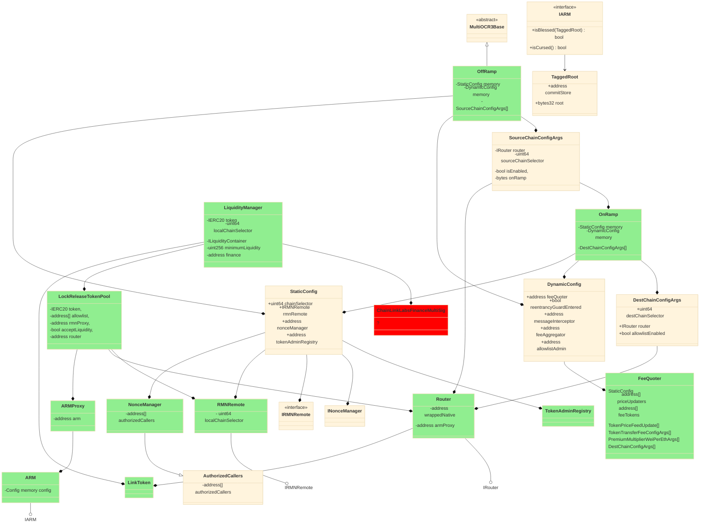

### Contract Architecture

```mermaid
%%{init: {'theme': 'base', 'themeVariables': { 'fontSize': '20px'}}}%%
classDiagram
    Router --* LinkToken

    OnRamp --* StaticConfig
    OnRamp --* DynamicConfig
    OnRamp --* DestChainConfigArgs
    
    OffRamp --* StaticConfig
    OffRamp --* DynamicConfig
    OffRamp --* SourceChainConfigArgs

    LiquidityManager --* LinkToken
    LiquidityManager --* LockReleaseTokenPool
    LiquidityManager --* ChainLinkLabsFinanceMultiSig

    SourceChainConfigArgs --* Router
    SourceChainConfigArgs --* OnRamp

    DynamicConfig --* FeeQuoter

    ARMProxy --* ARM
    LockReleaseTokenPool --* ARMProxy

    StaticConfig --* NonceManager
    StaticConfig --* RMNRemote

    RMNRemote --() IRMNRemote
    Router --() IRouter
    ARM --() IARM
    
    StaticConfig --* IRMNRemote
    StaticConfig --* INonceManager
    StaticConfig --* TokenAdminRegistry

    DestChainConfigArgs --* Router

    LockReleaseTokenPool --* Router
    LockReleaseTokenPool --* RMNRemote


    class TaggedRoot {
        +address commitStore
        +bytes32 root
    }

    IARM --> TaggedRoot

    class IRMNRemote {

    }

    <<interface>> IRMNRemote


    class MultiOCR3Base {

    }
    <<abstract>> MultiOCR3Base

    class IARM {
        +isBlessed(TaggedRoot) bool
        +isCursed() bool
    }
    <<interface>> IARM

    class AuthorizedCallers {
        -address[] authorizedCallers
    }

    class StaticConfig {
        +uint64 chainSelector
        +IRMNRemote rmnRemote
        +address nonceManager
        +address tokenAdminRegistry
    }

    class DynamicConfig {
        +address feeQuoter
        +bool reentrancyGuardEntered
        +address messageInterceptor
        +address feeAggregator
        +address allowlistAdmin
    }

    class DestChainConfigArgs {
        +uint64 destChainSelector
        +IRouter router
        +bool allowlistEnabled
    }

    class SourceChainConfigArgs {
        -IRouter router
        -uint64 sourceChainSelector
        -bool isEnabled, 
        -bytes onRamp
    }


  class FeeQuoter {
        StaticConfig 
        address[] priceUpdaters
        address[] feeTokens
        TokenPriceFeedUpdate[]
        TokenTransferFeeConfigArgs[]
        PremiumMultiplierWeiPerEthArgs[]
        DestChainConfigArgs[]
    }
    style FeeQuoter fill:lightgreen

    class LinkToken { 
    }
    style LinkToken fill:lightgreen
    
    class OnRamp {
        -StaticConfig memory
        -DynamicConfig memory
        -DestChainConfigArgs[]
    }
    style OnRamp fill:lightgreen

    class OffRamp {
        -StaticConfig memory
        -DynamicConfig memory
        -SourceChainConfigArgs[]
    }
    style OffRamp fill:lightgreen
    MultiOCR3Base <|-- OffRamp

    class Router {
        -address wrappedNative 
        -address armProxy
    }
    style Router fill:lightgreen

    class NonceManager {
        -address[] authorizedCallers
    }
    NonceManager --|> AuthorizedCallers
    style NonceManager fill:lightgreen

    class RMNRemote {
        - uint64 localChainSelector
    }
    style RMNRemote fill:lightgreen

    class LockReleaseTokenPool {
        -IERC20 token,
        -address[] allowlist,
        -address rmnProxy,
        -bool acceptLiquidity,
        -address router
    }
    style LockReleaseTokenPool fill:lightgreen

    class TokenAdminRegistry {
    }
    style TokenAdminRegistry fill:lightgreen

    class ARM {
        -Config memory config
    }
    style ARM fill:lightgreen

    class ARMProxy {
        -address arm
    }
    style ARMProxy fill:lightgreen

    class LiquidityManager {
        -IERC20 token
        -uint64 localChainSelector
        -ILiquidityContainer
        -uint256 minimumLiquidity
        -address finance
    }
    style LiquidityManager fill:lightgreen

    class ChainLinkLabsFinanceMultiSig {
        ?
    }
    style ChainLinkLabsFinanceMultiSig fill:red

```
